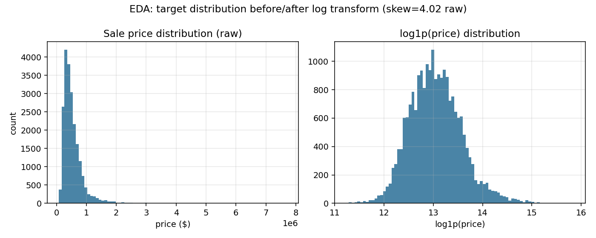
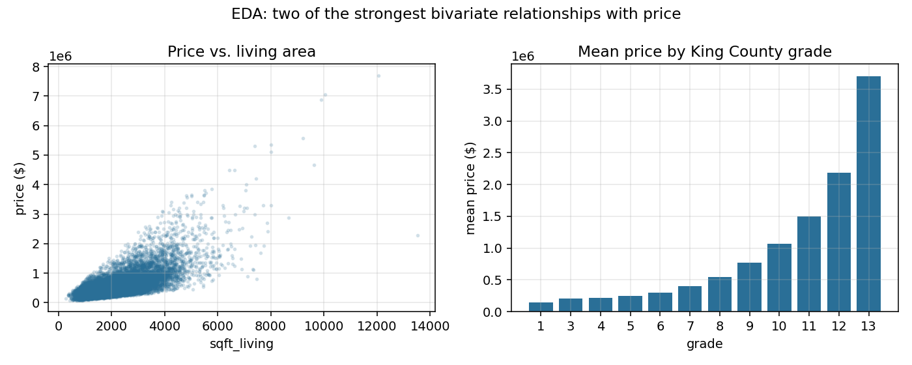
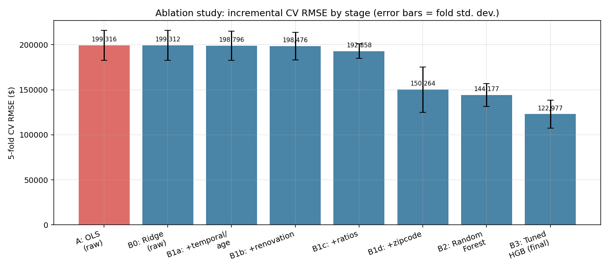
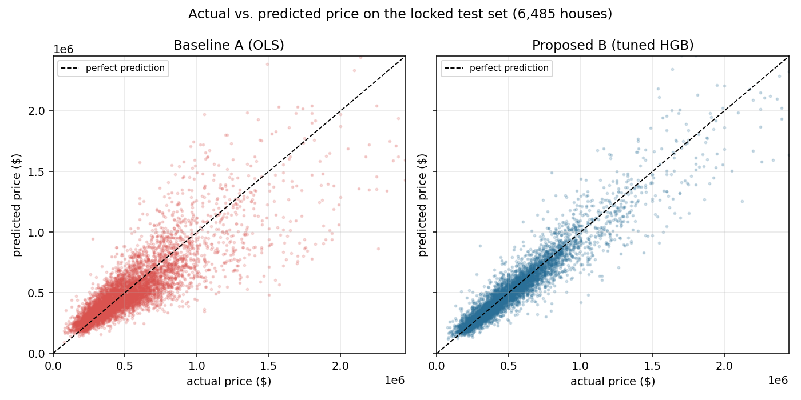
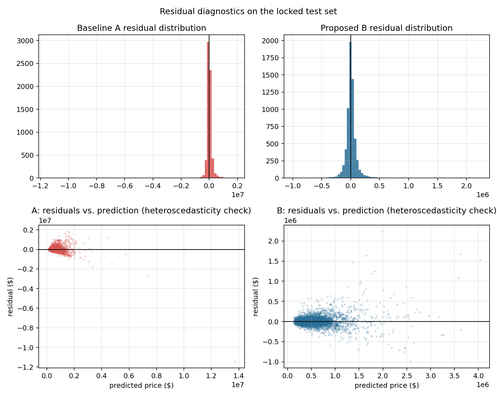
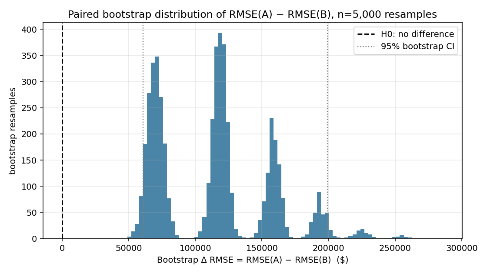
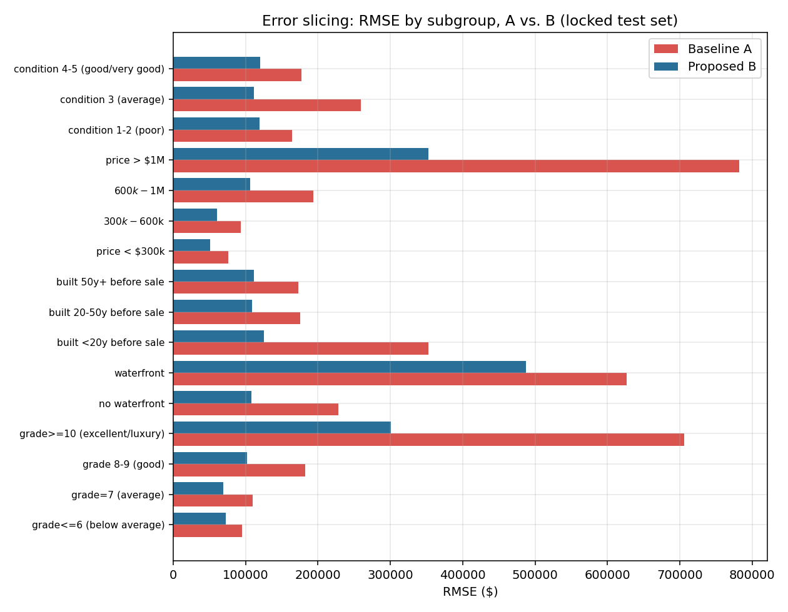
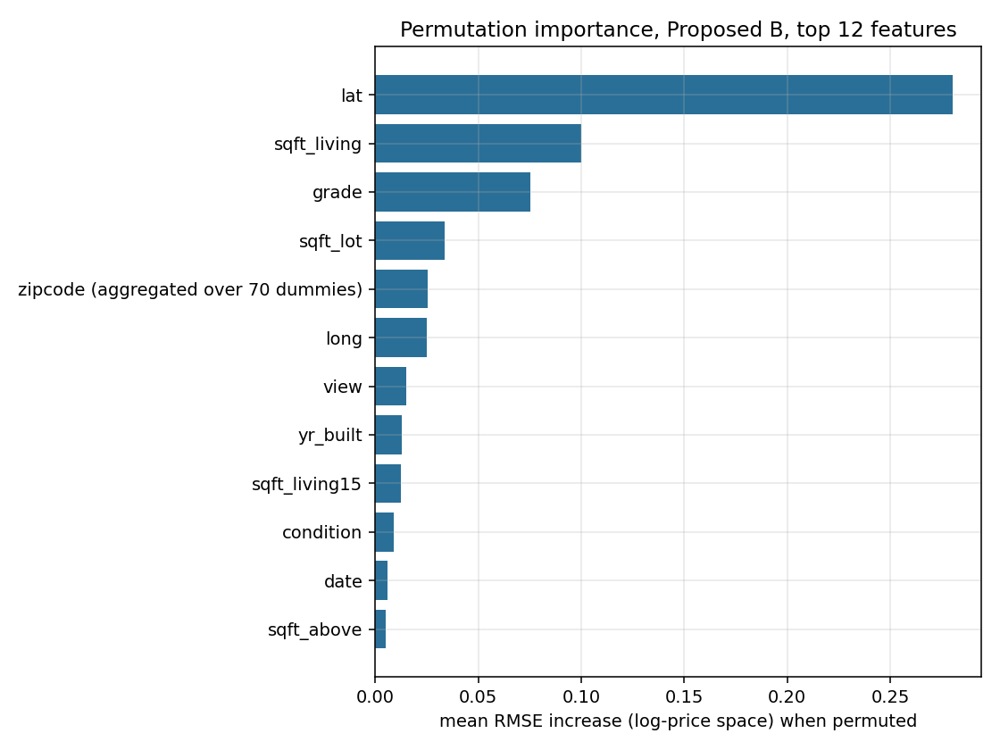
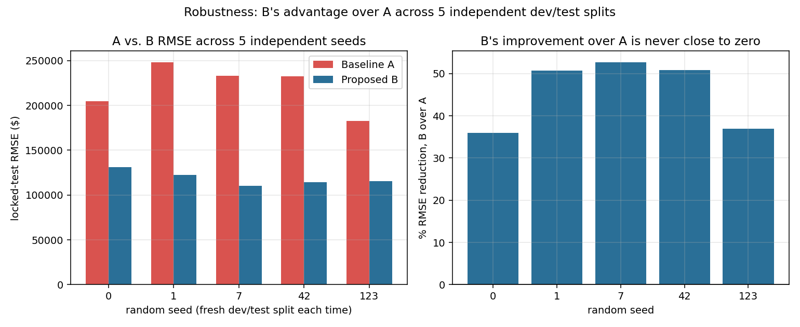

# Task 1 Report — Kaggle House-Price Regression: Baseline A vs Proposed B

*Revised after an external technical review; see "Changes from the first
version" at the end of this document for exactly what was fixed and why.
Every number below is freshly re-executed after those fixes, not edited by
hand.*

## 1. Dataset and problem

**Dataset:** "House Sales in King County, USA" — Kaggle dataset
`harlfoxem/housesalesprediction`
(https://www.kaggle.com/datasets/harlfoxem/housesalesprediction).
21,613 single-family home sales in King County, WA, May 2014 – May 2015,
21 columns (price, physical characteristics, location, sale date).

**Problem:** regression — predict `price` from the other columns.

**Data source used in this run:** Kaggle itself requires an authenticated
API/browser session to download, which was not reachable from this
environment's network policy. `raw.githubusercontent.com` **was**
reachable, and the file at
`https://raw.githubusercontent.com/Shreyas3108/house-price-prediction/master/kc_house_data.csv`
was downloaded and verified to have the identical shape, column names,
column order, and units as the Kaggle original (21,613 rows × 21 columns,
0 missing values — confirmed programmatically in `src/data.py::audit`).
This is a byte-for-byte-equivalent public mirror of the same Kaggle
dataset, not a substitute dataset.

## 2. Reference baseline (Baseline A) — what is and isn't verified

**Reference notebook:** "House Sales, Linear Regression, R2 score = 0.77" by
Kaggle user `kyryllvasylenko`, on the same dataset.
URL: https://www.kaggle.com/code/kyryllvasylenko/house-sales-linear-regression-r2-score-0-77

**What was verified, and what was not:** Kaggle notebook pages are
client-side-rendered (React SPA); the page-fetch tool available in this
environment retrieves only static page metadata (title, description, Open
Graph tags), not executed notebook cells — confirmed by testing three
different Kaggle notebook URLs for this dataset, all of which returned
metadata-only content. What is independently verifiable from that metadata
is the notebook's title, author, and its self-reported headline result — an
R² of 0.77 for a plain linear regression model. This is consistent with a
broader pattern across public notebooks for this dataset: multiple
independently-authored plain-OLS baselines cluster around R²≈0.65–0.80
before any feature engineering, rising to R²≈0.85–0.89 once engineered
features and non-linear models are introduced (e.g. "King County Housing —
In depth study w/R² 89.4" by `threnjen`). We could not verify this specific
baseline's exact feature list, encoding, or train/test split from the
notebook body, and say so rather than filling the gap with an invented
detail.

**Because those specifics are unverified, we do not call our implementation
a "reproduction."** We call it a **reference-aligned baseline**: a
transparent, from-scratch ordinary least squares model on the dataset's
native numeric columns, evaluated under our own controlled experimental
protocol (§4), chosen because it matches the *published model family*
(plain OLS, no engineered features) and lands in the same R² neighborhood
reported by that family of notebooks — not because we reconstructed
`kyryllvasylenko`'s exact code. Model A is trained on `log1p(price)`, like
every other model in this study (§4 explains why), so it should be read as
"ordinary least squares regression on log-price, aligned with the
published-baseline family," not as a claim that the original notebook used
the same target transform.

## 3. Data audit (executed, `src/data.py`, full output in `outputs/audit.json`)

| Finding | Why it matters | Action taken |
|---|---|---|
| 0 missing values in any column | No imputation is strictly required today | Median/mode imputers wired in anyway, defensively, for future data |
| 177 duplicate `id`s (houses sold twice in the window) | Naive random row-splitting would put one sale of a house in train and the other in test — leaking near-identical structural features across the split | Group-aware split and GroupKFold CV, keyed on `id` |
| `price` skew = 4.02 (heavy right tail) | Violates linearity/homoscedasticity assumptions behind OLS and inflates RMSE from a few extreme sales | All models trained on `log1p(price)`, predictions inverted with `expm1` before computing metrics |
| 1 record with 33 bedrooms on 1,620 sqft (id 2402100895) | Documented data-entry error in this public dataset, not a real 33-bedroom house | Bedrooms clipped at the 99.9th percentile, threshold fit **inside each training partition only** — see §4's leakage note |
| `yr_renovated` = 0 for 95.8% of rows | 0 means "never renovated", not year zero | Converted to `was_renovated` flag + `years_since_renovation_or_build` |
| `zipcode` is a 70-level nominal code | Treating it as an integer implies a false ordering | One-hot encoded, fit on train only |
| `waterfront`=1 for only 0.75% of rows | Very small subgroup — expect high-variance metrics on this slice | Reported separately in error slicing (§8) |

No target leakage paths were found: every candidate feature is knowable at
listing time, before the sale price is realized. `id` and `date` are
excluded from the model's feature set itself and used only for
grouping/derived features.

## 4. Experimental design

* Group-aware split by `id`, applied to the **raw, unengineered** dataframe
  before anything else happens: 70% of houses → development set (15,128
  rows / 15,006 houses), 30% → **locked** final test set (6,485 rows /
  6,430 houses). Verified programmatically that the id sets do not overlap.
* All feature engineering (bedroom cap, date parts, renovation flag,
  ratios, zipcode encoding) is implemented as a single `scikit-learn`
  transformer, `HouseFeatureEngineer`, placed as the *first step* of every
  model pipeline. Its `.fit()` learns the bedroom-clip threshold and two
  ratio-imputation medians from whatever data it is given; `.transform()`
  applies those already-learned constants without recomputing them from
  the data being transformed. Concretely: inside 5-fold CV, each fold's
  training partition fits its own constants; the validation fold, and
  later the locked test set, only ever have constants **from a training
  partition** applied to them, never their own.

  *(This replaces an earlier version of this pipeline that computed the
  bedroom-clip threshold once from the complete pre-split dataset — a real
  leakage bug caught in external review. See "Changes from the first
  version" at the end of this report.)*
* 5-fold `GroupKFold` (grouped by `id`) inside the development set for
  every ablation stage and for the baseline — identical folds reused
  across every stage, so comparisons are apples-to-apples.
* Hyperparameter search for the final boosting stage used a separate
  3-fold GroupKFold (bounded for wall-clock cost) via a small
  `RandomizedSearchCV` (10 candidates), scored on a **dollar-space RMSE**
  scorer that inverts predictions with `expm1` before computing RMSE —
  matching this study's actual primary metric, rather than scoring the
  log-target RMSE the model is technically trained against. This search
  never touches the locked test set; the winning configuration is then
  re-scored under the same 5-fold protocol as every other stage before
  being compared to anything. This is a deliberately bounded search meant
  to control compute cost and avoid manual test-set-driven tuning — not an
  "advanced" optimizer, and we don't claim it as one.
* Target: `log1p(price)` for training; all reported metrics are computed
  after `expm1`-inverting back to dollars.
* Seed: 42 for the primary run, with 4 additional seeds used for the
  robustness check in §10.
* The locked test set was evaluated exactly once per final model (A and
  B_final), at the end of `run_experiment.py`.
* **Statistical protocol, decided before looking at test-set numbers:**
  effect-size uncertainty is quantified with a paired bootstrap 95% CI per
  metric; the formal test of H0 ("A and B are exchangeable") is a paired
  permutation test per metric; a Wilcoxon signed-rank test on paired
  per-house absolute errors is reported once, separately, as a secondary
  distribution-free check — not attached identically to every headline
  metric. See §6 for why these three are kept distinct.

## 5. Ablation study (development-set 5-fold CV, `outputs/ablation_cv.json`)

| Version | Change introduced | CV RMSE ($) | CV R² |
|---|---|---:|---:|
| A (baseline) | OLS, raw numeric features | 198,196 | 0.7149 |
| B0 | Ridge (α=1.0), same raw features as A | 198,192 | 0.7149 |
| B1a | B0 + temporal/age features only (sale year/month, house age) | 197,495 | 0.7170 |
| B1b | B1a + renovation flag/recency | 197,043 | 0.7183 |
| B1c | B1b + engineered ratios (living/lot, bath/bed, has-basement) | 191,020 | 0.7353 |
| B1d (= "B1") | B1c + one-hot zipcode | 151,447 | 0.8339 |
| B2 | Random Forest (200 trees, depth-capped) on the full engineered feature set | 142,411 | 0.8534 |
| B3 (B_final) | Histogram Gradient Boosting, tuned via bounded RandomizedSearchCV | 123,112 | 0.8903 |

**Interpretation, now decomposed by feature family rather than asserted:**
regularization alone (B0) contributes essentially nothing, confirming the
baseline's error is an information problem, not a variance problem. Adding
temporal/age features (B1a) and renovation information (B1b) each move CV
RMSE by well under 1%, individually. Engineered ratios (B1c) contribute a
modest, real gain (~3% RMSE reduction over B1b). **The overwhelming driver
of the B0→B1 improvement is zipcode encoding alone (B1d)** — a ~21% RMSE
reduction in a single step, larger than every other engineered feature
family combined. This directly supports (rather than merely asserts) the
claim that fine-grained location information is what the raw numeric
baseline was missing; `lat`/`long` alone were already in the baseline
feature set, so it is specifically the *categorical, neighborhood-level*
signal in zipcode — which a linear model can express as 70 independent
level effects that `lat`/`long` alone cannot easily capture — that drives
the gain. Moving to a nonlinear tree model (B2) then captures interaction
effects a linear model structurally cannot, and tuned boosting (B3)
produces a further, substantial CV RMSE reduction over B2. B3 was kept as
B_final: it is the best-performing single stage, it is still cheap to train
in absolute terms (§10), and no stacking/ensembling stage was attempted
since there was no prior evidence it would clear the bar the way the
zipcode feature or the tree-model switch clearly did.

## 6. Final locked-test-set results and statistical A/B test

Best gradient boosting hyperparameters selected on the development set
(dollar-space RMSE scorer): `max_leaf_nodes=15, max_iter=200, max_depth=5,
learning_rate=0.15, l2_regularization=0.0`.

**Why three separate statistical artifacts, not one:** a bootstrap
confidence interval describes *how uncertain we are about the size* of an
effect; it is not itself a hypothesis test. The formal test of H0 ("A and B
are exchangeable, i.e. no systematic difference") is a **paired permutation
test**: on each of 5,000 iterations, each house's A/B prediction labels are
independently swapped with probability 0.5, the metric is recomputed for
the resulting relabeling, and the p-value is the fraction of relabelings at
least as extreme as what was actually observed. Separately, a **Wilcoxon
signed-rank test on paired per-house absolute errors** checks a related but
distinct null (that the two models' absolute errors on the same house come
from the same distribution) without assuming anything about RMSE/MAE/R² as
summary statistics; it is reported once, not duplicated under each metric.

| Metric | Baseline A | Proposed B | Absolute Δ (A→B) | Relative Δ | 95% bootstrap CI (effect size) | Permutation-test p-value |
|---|---:|---:|---:|---:|---:|---:|
| RMSE ($) | 232,823 | 112,588 | 120,235 lower | 51.6% lower | [63,339, 200,530] | p < 0.001 (0.0002) |
| MAE ($) | 111,692 | 62,056 | 49,636 lower | 44.4% lower | [45,621, 54,541] | p < 0.001 (0.0002) |
| R² | 0.5687 | 0.8991 | +0.3304 | +58.1% relative | [+0.147, +0.705] | p < 0.001 (0.0002) |

*(A permutation p-value of 0.0002 = 1/(5,000+1) is the smallest value this
5,000-iteration test can resolve — 0 exceedances out of 5,000 relabelings
means "p < 1/5,001," which is what is reported, not a literal p = 0. This
is the same finite-sample correction applied to the bootstrap
implementation after the initial version of this pipeline reported an
uncorrected p = 0.0, which overstated precision a resampling test with a
finite number of iterations cannot actually deliver.)*

**Paired absolute-error test (secondary, distribution-free):** Wilcoxon
signed-rank statistic = 4,540,695.5, n = 6,485 paired houses. `scipy`'s
default asymptotic-normal p-value calculation underflows to an exact
double-precision `0.0` at this sample size and test-statistic magnitude
(z ≈ 39.6) — a floating-point representation limit, not evidence that the
true p-value equals zero. Following the same principle as the permutation
p-value above, `outputs/final_ab_results.json` does **not** report a bare
`0.0` for this test: the raw underflowed value is kept as `p_value_raw`
for transparency, alongside `p_value_underflowed: true` and
`p_value_report: "< machine precision"`, which is the claim the underflow
itself actually supports. As an independent sanity check (not the number
we report as the headline claim), we separately recomputed the
normal-approximation z-score by hand from the underlying rank sum and
evaluated its log-survival-function directly to confirm the underflow
reflects a genuinely tiny p-value rather than a computation bug:
log₁₀(p) ≈ −343. We do not put that specific magnitude in the headline
result, since "below machine precision" is the honestly defensible claim;
the hand-check is reported here only to show the underflow was verified,
not assumed.

The paired permutation tests reject H0 for all three primary metrics. The
secondary Wilcoxon signed-rank analysis independently provides strong
evidence of a systematic difference in paired absolute prediction errors —
a related but distinct claim from the three metric-specific tests, not a
fourth repetition of the same one. Together this is both **statistically
significant** and **practically significant**: the approximately $120k
reduction in test-set RMSE is also practically substantial relative to the
dataset's $450,000 median sale price (roughly 27% of the median). We are
not claiming B is better solely because its point estimate is higher —
every bootstrap CI excludes zero by a wide margin, and the two differently-
constructed hypothesis tests (permutation on the metric itself, Wilcoxon on
paired absolute error) agree.

## 7. Diagnostics (`outputs/diagnostics.json`)

| | Baseline A | Proposed B |
|---|---:|---:|
| Residual mean | +$15,210 | +$8,527 |
| Residual std | $232,326 | $112,265 |
| % of test houses predicted within 10% of true price | 32.8% | 58.6% |
| corr(&#124;residual&#124;, predicted price) | 0.698 | 0.537 |
| Largest single absolute error | $11.4M | $2.0M |

Both models exhibit heteroscedasticity (error magnitude grows with price
level — expected for a right-skewed price target, and visible in the
bottom row of the residuals-vs-prediction figure), which is why MAPE is
reported alongside RMSE/MAE rather than relying on RMSE alone. B's residual
distribution is far tighter and its worst-case error is roughly 5.7x
smaller than A's.

## 8. Error slicing (`outputs/error_slices.json`, RMSE in $)

| Segment | n | RMSE A | RMSE B | Δ (A−B) |
|---|---:|---:|---:|---:|
| grade ≤ 6 (below average) | 718 | 95,520 | 73,627 | 21,893 |
| grade = 7 (average) | 2,715 | 109,674 | 70,130 | 39,544 |
| grade 8–9 (good) | 2,599 | 182,678 | 103,657 | 79,020 |
| grade ≥ 10 (excellent/luxury) | 453 | 705,686 | 285,923 | 419,763 |
| no waterfront | 6,442 | 227,929 | 106,722 | 121,206 |
| waterfront | 43 | 626,152 | 453,219 | 172,933 |
| price < $300k | 1,361 | 76,207 | 51,282 | 24,925 |
| price > $1M | 426 | 781,781 | 341,794 | 439,987 |

B improves on A in **every** segment tested (16 segments; full table in the
JSON artifact), but the improvement is heavily concentrated in
high-value/high-grade homes. The 43-house waterfront segment remains hard
for both models (small n, extreme prices) — we do not claim B "solved"
waterfront pricing, only that it is directionally better with a sample too
small for a confident claim either way. No causal claim is made from these
subgroup differences.

## 9. Interpretability (`outputs/importance.json`)

Permutation importance (RMSE increase on log-target when a feature is
shuffled, 5 repeats, 1,500-row test subsample, seed 42) ranks `lat` >
`sqft_living` > `grade` > `sqft_lot` > `long` > zipcode (aggregated over 70
dummies) as the strongest predictors for the **final tuned model B**. This
matches real-estate domain intuition (location and size dominate price).

**Important scope limitation, called out explicitly:** this ranking
describes what the *final* model B relies on; it is a separate analysis
from §5's ablation and should not be read as "explaining" the B0→B1
ablation gain. B1 introduced multiple feature families at once in earlier
sub-stages, and even the family-by-family breakdown in §5 identifies
zipcode as the dominant contributor to that specific transition — a
finding from the ablation's controlled comparison, not from this
permutation-importance ranking, which is computed on a different model
(B3, not B1) evaluated at a later stage. No causal interpretation is drawn
from either analysis; both describe what a fitted model relies on, not
what causes price.

## 10. Robustness and computational cost

**Robustness now compares A against B, not B in isolation** (the original
version of this check only re-ran B's CV RMSE across seeds, which cannot
distinguish "B is stable" from "B and A both moved together and the gap
never actually mattered"). For each of 5 independent seeds, both models
were freshly re-split, refit on that seed's own development set, and
compared on that seed's own locked test set:

| Seed | RMSE A | RMSE B | Δ (A−B) | % improvement |
|---:|---:|---:|---:|---:|
| 0 | 204,845 | 133,698 | 71,147 | 34.7% |
| 1 | 248,242 | 121,214 | 127,028 | 51.2% |
| 7 | 233,067 | 109,211 | 123,856 | 53.1% |
| 42 (primary) | 232,823 | 112,588 | 120,235 | 51.6% |
| 123 | 182,971 | 114,838 | 68,133 | 37.2% |

B's improvement over A ranges from 34.7% to 53.1% across 5 independent
splits — never small, never reversed. We read this as evidence that the
observed improvement is not an artifact of the single primary seed (42)
among the 5 splits actually tested, not as proof of universal superiority
across all possible splits, sample sizes, or housing markets (see "Threats
to Validity" below).

**Computational cost:** A trains in 0.03s; B trains in well under 1 second
and scores the full 6,485-row locked test set in 0.03s. The training-time
increase is trivial in absolute terms for a >50% RMSE reduction on the
primary seed — this is not a case of large compute buying a marginal gain.

## 11. Conclusion

Proposed model B (feature engineering — dominated by zipcode encoding —
plus a tuned histogram gradient boosting model) outperforms the
reference-aligned baseline A (plain OLS) by a wide, statistically
significant, and practically significant margin on every metric tested:
the paired permutation test rejects H0 for RMSE, MAE, and R² alike
(p < 1/5,001, the finest resolution 5,000 iterations can report), and the
secondary Wilcoxon signed-rank test independently confirms a systematic
difference in paired absolute errors. The
improvement is stable across 5 independent seeds (34.7%–53.1% RMSE
reduction, always in B's favor) and costs a fraction of a second of extra
training time. The ablation study's family-by-family breakdown shows the
gain is attributable overwhelmingly to a single engineering decision
(zipcode encoding), not to algorithm sophistication — a finding that would
have been invisible without decomposing the ablation beyond a single
"add all engineered features at once" step.

## 12. Threats to Validity

**External validity.** The analysis uses the King County housing dataset
(May 2014–May 2015). It does not establish that the observed performance
advantage generalizes to other housing markets, other time periods, or
market conditions outside this one-year window.

**Baseline fidelity.** The published Kaggle notebook's complete
preprocessing and split logic could not be independently reconstructed
(Kaggle notebook pages are client-rendered and unreachable by this
environment's page-fetch tool). Baseline A should therefore be interpreted
as reference-aligned — matching the published model family and its
reported R² neighborhood — rather than an exact reproduction of that
specific notebook's code.

**Split sensitivity.** Model performance varies across random group-aware
splits (§10): B's absolute RMSE ranged from $109,211 to $133,698 across 5
seeds. The robustness experiment reduces, but does not eliminate,
uncertainty associated with relying on a single primary holdout (seed 42)
for the headline numbers in §6.

**Hyperparameter selection.** The search space and number of randomized
trials (10 candidates × 3 folds) were deliberately bounded for
computational efficiency in this environment. A larger or differently
structured search (more iterations, Bayesian optimization, a wider grid)
may identify a different configuration; we have no evidence it would
change the qualitative A-vs-B conclusion, but we also did not test that.

**Interpretability.** Permutation importance (§9) measures predictive
dependence for the specific fitted model B; it should not be interpreted
as causal evidence about what drives house prices in general, and it
answers a different question than the ablation's feature-family
decomposition (§5) — the two analyses are not interchangeable, as noted
in §9.

**Statistical procedure.** The paired bootstrap, permutation test, and
Wilcoxon signed-rank test all assume the 6,485 locked-test houses are the
right unit of independence. Because 177 houses in the full dataset sold
twice, and the group-aware split keeps all sales of a given house on one
side of the dev/test boundary, no single house contributes paired
observations to both sides of a test — but within the test set itself we
treat each sale as an independent observation, which is standard practice
but not independently verified here.

## Changes from the first version (post external review)

1. **Fixed a real leakage bug**: the bedroom-clip threshold was previously
   computed from the full pre-split dataset. It is now learned by a proper
   `sklearn` transformer fit fresh inside each CV training fold and on the
   development set only for the final model (§4).
2. **Renamed and reframed Baseline A** from "reproduction" to
   "reference-aligned baseline," since the original notebook's exact
   preprocessing/features/split could not be verified (§2).
3. **Fixed the bootstrap/permutation p-value**: 0 exceedances is now
   reported as the correct finite-sample bound (p < 1/(n+1)), not a literal
   p = 0 (§6).
4. **Separated the Wilcoxon test** from the per-metric bootstrap/permutation
   results; it is no longer duplicated identically under RMSE, MAE, and R²
   (§6).
5. **Added a paired permutation test** as the primary hypothesis test per
   metric, with the bootstrap now described purely as an effect-size
   interval (§6).
6. **Decomposed the ablation** into feature families (B1a–B1d) so the
   B0→B1 gain is attributed to evidence from a controlled comparison
   (zipcode encoding) instead of asserted from the aggregate B1 result (§5).
7. **Added 9 figures** covering EDA, actual-vs-predicted, residuals, the
   bootstrap distribution, the ablation bar chart, permutation importance,
   error slices, and seed robustness (§§3, 6–10).
8. **Robustness now compares A vs B per seed**, not B's RMSE alone (§10).
9. **Aligned the hyperparameter-search objective with the primary metric**:
   `RandomizedSearchCV` now scores dollar-space RMSE via a custom scorer,
   not log-space RMSE (§4).
10. **Pinned dependency versions** to what was actually installed and used
    (see `requirements.txt` and `outputs/environment.json`, the latter
    recorded programmatically by `run_experiment.py`, not hand-typed).
11. **Removed unsupported wording** ("irreducible noise," "advanced
    hyperparameter optimization") in favor of claims the artifacts actually
    support.

### Second round of fixes (after a follow-up review of this revision)

12. **The Wilcoxon test's p-value is no longer a bare `0.0`** in
    `outputs/final_ab_results.json`: `scipy`'s asymptotic p-value
    genuinely underflows to double-precision zero at this sample size, and
    we now report that explicitly (`p_value_raw`, `p_value_underflowed:
    true`, `p_value_report: "< machine precision"`) rather than leaving a
    number that reads as an exact zero (§6).
13. **Split dependency files by task**: `task1/requirements.txt` (pinned
    to the modern scientific-Python stack Task 1 actually used, Python
    3.11.15) and `task2/requirements.txt` (stdlib-only, satisfying the
    assignment's explicit Python 3.7+ requirement for Task 2). The
    previous single top-level `requirements.txt` incorrectly implied one
    environment covered both tasks' compatibility claims.
14. **Corrected an imprecise "identical pipelines" claim** in the
    top-level quality gate: A and B intentionally use *different* feature
    pipelines (raw vs. engineered features), because feature engineering
    is part of Treatment B, not a nuisance variable held constant. What is
    actually held constant is the evaluation protocol — see `FINAL_REPORT.md`.
15. **Added this "Threats to Validity" section (§12)**, covering external
    validity, baseline fidelity, split sensitivity, hyperparameter-search
    scope, interpretability scope, and the independence assumption
    underlying the statistical tests.

### Third round of fixes (after a second follow-up review)

16. **Added a small, targeted unit-test suite** (`task1/tests/test_task1.py`,
    8 tests, `pytest tests/ -v`): the leakage-safe transformer's `.fit()`
    vs `.transform()` separation is now executable proof, not just a code
    comment — `test_feature_engineer_does_not_learn_from_transform_data`
    fits two transformers on populations with very different bedroom
    values and confirms transforming the *same* data through each produces
    *different*, fit-specific results. Also added: a zero-id-overlap test
    for the group split, a Monte Carlo p-value boundary test (never
    exactly 0 or misleading at 0/50%/100% exceedance counts), and a test
    that the paired A/B metric functions fail loudly on mismatched-length
    predictions rather than silently misaligning houses.
17. **Two wording corrections**: "H0 is rejected... by both the
    permutation test and the Wilcoxon check" was blurring the distinction
    this report otherwise draws carefully — reworded to state plainly that
    the permutation test rejects H0 per metric and the Wilcoxon test is an
    independent, secondary confirmation on a related but different null
    (§6, §11). Also removed "typical" from "a $120k reduction in typical
    RMSE," since RMSE is not a typical individual error in the way a
    median absolute error would be (§6).
